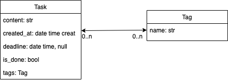
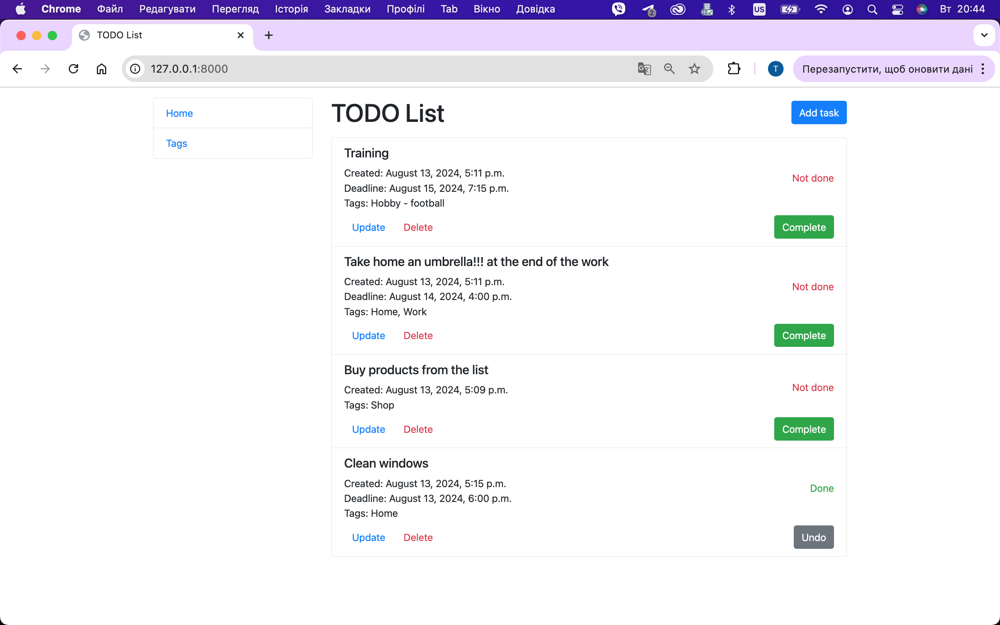

# Todo list service

### This is a site that implements a simple service "todo".

<br>

## Access to service


### Python3 must be already installed

## Set Up

```shell
git clone https://github.com/TarasFirst/todo-list.git
cd todo-list
python3 -m venv venv
source venv/bin/activate (on macOS)
pip install -r requirements.txt
python manage.py makemigrations
python manage.py migrate
python manage.py runserver
```

## Features
* Add tasks, update and delete.
* Add tags, update and delete..
* Mark as done or undo.
* And some other features.
* Set deadlines.


## Demo

### Structure database


### Some pages



